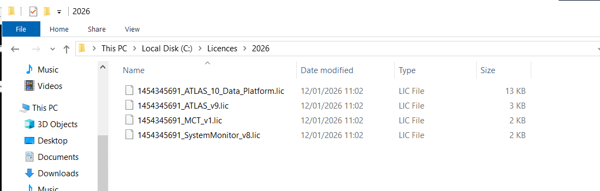
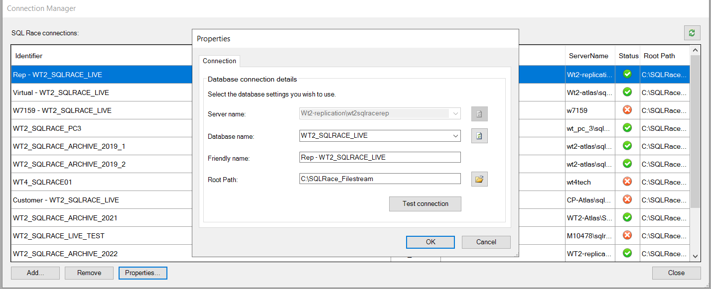
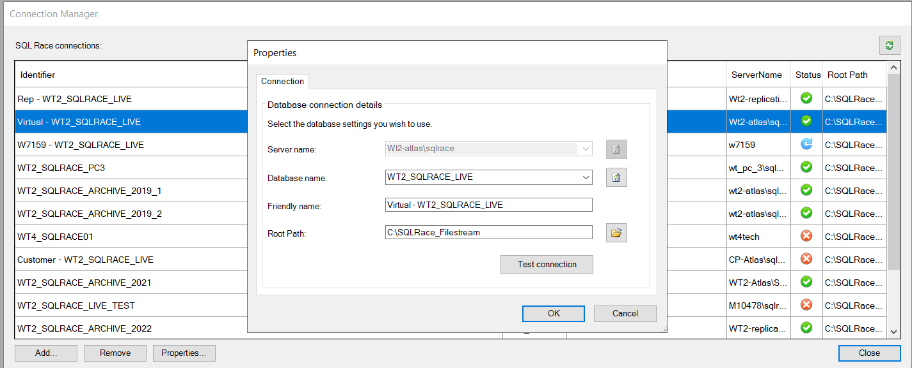
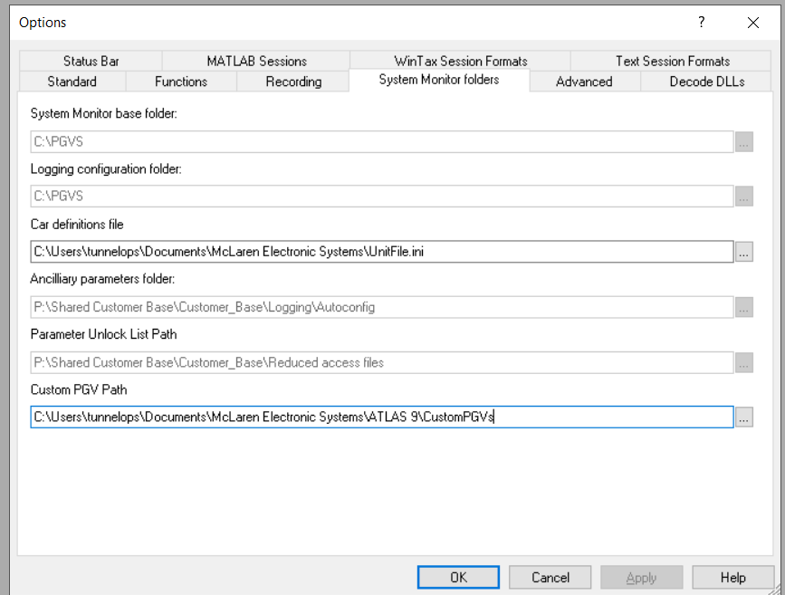

Option 2 (more formal):
“Kindly configure shr-tunops-dan in Atlas Licence Manager and assign Atlas and Atlas Data Server licences in support of the Shared Account Remediation project.”

Raise SD call to add new user shr-tunops-dan to send through to SQL DB Team to assign permissions.

Machine: WT_PC_3

Standard Bar

C:\Users\tunnelops\Documents\McLaren Electronic Systems\ATLAS 9\Data\
C:\Users\tunnelops\Documents\McLaren Electronic Systems\ATLAS 9\Workbooks
C:\Users\TUNNEL~1\AppData\Local\Temp\
C:\Users\tunnelops\Documents\McLaren Electronic Systems\ATLAS 9\Circuits
C:\Users\tunnelops\Documents\McLaren Electronic Systems\ATLAS 9\Bitmaps
C:\Program Files (x86)\McLaren Electronic Systems\ATLAS 9\CustomDisplays
C:\Users\tunnelops\Documents\McLaren Electronic Systems\ATLAS 9\Atlas.ini

Advanced

Export Jobs Library

C:\Users\tunnelops\Documents\McLaren Electronic Systems\ATLAS 9\ExportJobs

Checks Library

C:\Users\tunnelops\Documents\McLaren Electronic Systems\ATLAS 9\Checks

Session DLLs Folder

C:\Program Files (x86)\McLaren Electronic Systems\ATLAS 9\SessionDLLs

Bit Display Config File

C:\Users\tunnelops\Documents\McLaren Electronic Systems\ATLAS 9

